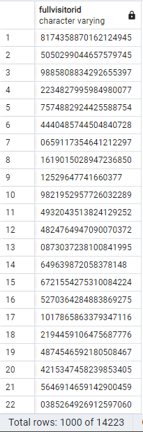
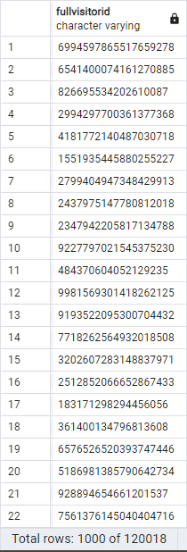
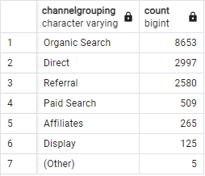
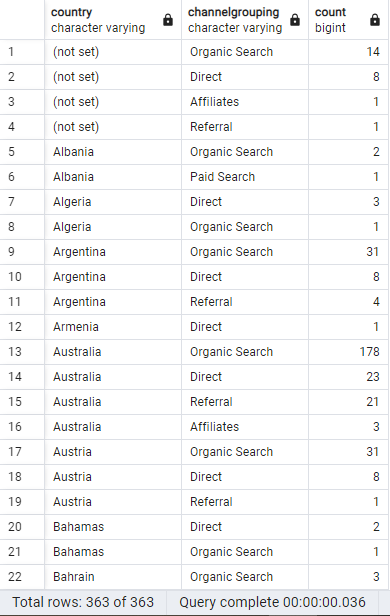
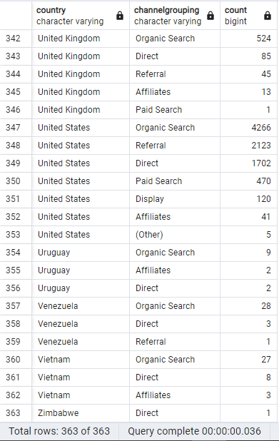

## Question 1: Find how many unique visitors are in the database? 

### SQL Queries:
```
SELECT DISTINCT fullvisitorid
FROM all_sessions

SELECT DISTINCT fullvisitorid
FROM analytics
```
### Answer: 

Unique number of visitors from the all_sessions table (14,223)



Unique number of visitors from the analytics table (120,018)



The database seems to be extremely incomplete as there is a large discrepensies in the number of unique visitors between the all_sessions and analytics tables.

## Question 2: What is the most common channelgrouping from the all_sessions table?

### SQL Queries:
```
SELECT channelgrouping, COUNT(channelgrouping) 
FROM all_sessions
GROUP BY channelgrouping
ORDER BY COUNT(channelgrouping) DESC
```
### Answer:

Organic search is the most popular




## Question 3: Is there a preference in channelgrouping by country?

### SQL Queries:
```
SELECT country, channelgrouping, COUNT(channelgrouping) 
FROM all_sessions
GROUP BY country, channelgrouping
ORDER BY country, COUNT(channelgrouping) DESC
```
### Answer:





Organic search is the most popular channelgrouping amongst the majority of the countries


