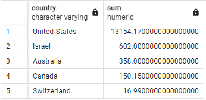
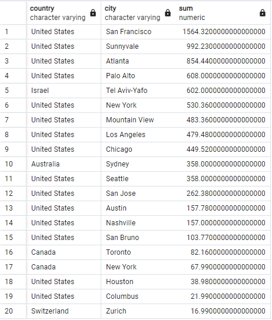
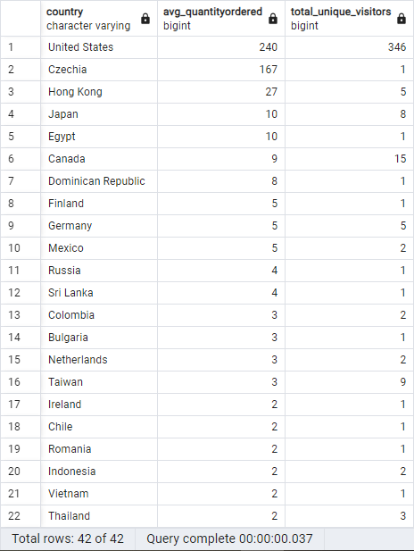
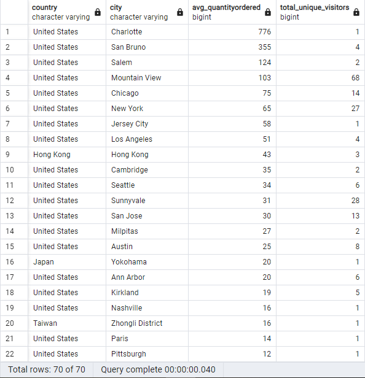
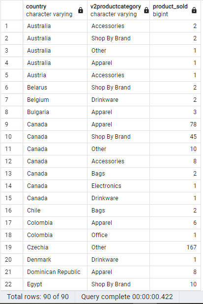
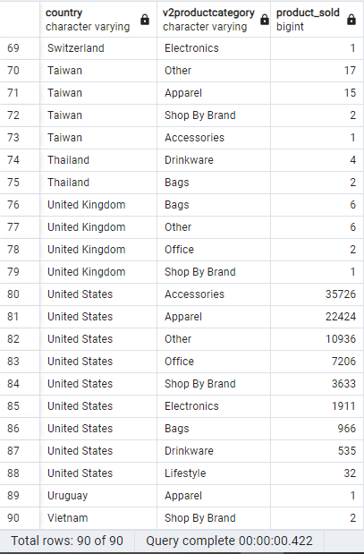
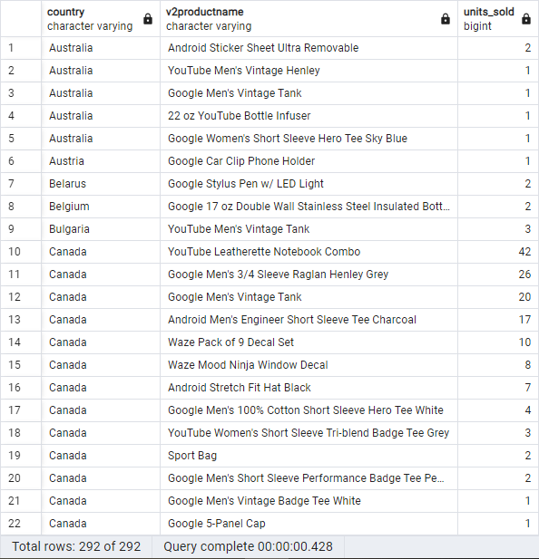
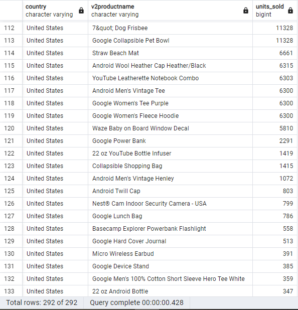
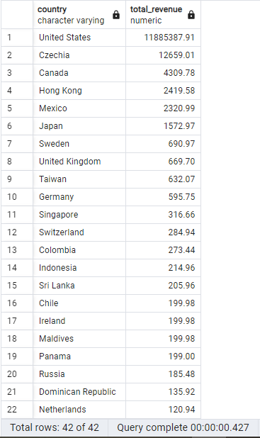
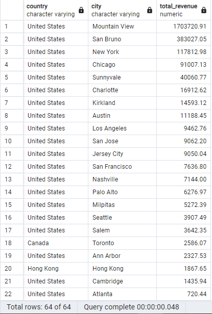

# Answer the following questions and provide the SQL queries used to find the answer.

    
## **Question 1: Which cities and countries have the highest level of transaction revenues on the site?**


### SQL Queries:
```
-- Creating a temp table with totaltransactionrevenue cleaned of extra 0s
CREATE TEMP TABLE all_sessionsv1(
	country VARCHAR,
	city VARCHAR,
	totaltransactionrevenue NUMERIC 
);

INSERT INTO all_sessionsv1 (country, city, totaltransactionrevenue)
	SELECT 
		country,
		city,
		CAST(totaltransactionrevenue AS NUMERIC)/1000000 AS totaltransactionrevenue -- clean out the extra 0s
	FROM all_sessions
	WHERE CAST(totaltransactionrevenue AS NUMERIC) IS NOT NULL; -- filter out all NULL values

-- Countries with the highest transaction revenue 
SELECT country, SUM(totaltransactionrevenue) 
FROM all_sessionsv1 
GROUP BY country 
ORDER BY SUM(totaltransactionrevenue) DESC;

-- Cities and their respective country with the highest transaction revenue
SELECT country, city, SUM(totaltransactionrevenue) 
FROM all_sessionsv1 
WHERE city <> 'not available in demo dataset' -- filtering out cities that are not defined
GROUP BY country, city
ORDER BY SUM(totaltransactionrevenue) DESC; 
```

### Answer:

The country with the highest level of transaction revenue is the United States with 13,154.17

 

The cities with the highest level of transaction revenue:



*It is important to note however that the data is rather incomplete. After filtering out the NULL values from totaltransactionrevenue, we are left with only 81 rows. Drawing conclusion from such a small sample size, will likely be inacurate. Equally, when we look at cities, further chunk of data is filtered out due to the fact that many rows for cities are 'not anailable in demo dataset'.  


## **Question 2: What is the average number of products ordered from visitors in each city and country?**


### SQL Queries:
```
-- Creating a temp table that joins columns from all_sessions and analytics tables (quantityordered = units_sold FROM analytics)
CREATE TEMP TABLE productsold(
	fullvisitorid VARCHAR,
	country VARCHAR,
	city VARCHAR,
	quantityordered INT
);

INSERT INTO productsold (fullvisitorid, country, city, quantityordered)
	SELECT 
		als.fullvisitorid,
		als.country,
		als.city,
		CAST(a.units_sold AS INT) -- renamed to quantityordered in the temp table
	FROM all_sessions als
	JOIN analytics a ON als.fullvisitorid = a.fullvisitorid
	WHERE CAST(a.units_sold AS INT) >= 1 -- filtering out NULL values and 0 values;

-- returns average quantity ordered from visitors by country
WITH countrytotals AS ( 
    SELECT
        country,
        SUM(quantityordered) AS total_quantityordered, -- total quantity ordered from all visitors by country
        COUNT(DISTINCT fullvisitorid) AS total_unique_visitors -- total counts of unique visitors by country
    FROM
        productsold
    GROUP BY
        country
)
SELECT
    country,
    total_quantityordered / total_unique_visitors AS avg_quantityordered, -- represents the average number of products ordered per unique visitors
    total_unique_visitors
FROM
    countrytotals
ORDER BY avg_quantityordered DESC;

-- returns average quantity ordered from visitors by country and city
WITH citytotals AS ( 
    SELECT
        country,
		city,
        SUM(quantityordered) AS total_quantityordered, -- total quantity ordered from all visitors by country and city
        COUNT(DISTINCT fullvisitorid) AS total_unique_visitors -- total counts of unique visitors by country and city
    FROM
        productsold
    GROUP BY
        country, city
)
SELECT
    country,
	city,
    total_quantityordered / total_unique_visitors AS avg_quantityordered, -- represents the average number of products ordered per unique visitors
	total_unique_visitors
FROM
    citytotals
WHERE city <> 'not available in demo dataset' -- filtering out undefined data 
ORDER BY avg_quantityordered DESC;
```

### Answer:

Average number of products ordered from visitors by country:



Average number of products ordered from visitors by country and city:



*Some city/country have very few unique visitors which can skew the results of the average number of products ordered. If they have a high average number of orders it could possibly be a company buying in bulk like in the case of Charlotte, United States.


## **Question 3: Is there any pattern in the types (product categories) of products ordered from visitors in each city and country?**


### SQL Queries:
```
-- creating a temp table with relevant info on products from all_sessions and units_sold column from analytics table
CREATE TEMP TABLE productinfo(
	fullvisitorid VARCHAR,
	country VARCHAR,
	city VARCHAR,
	productsku VARCHAR,
	v2productname VARCHAR,
	v2productcategory VARCHAR,
	units_sold INT
);

INSERT INTO productinfo(fullvisitorid, country, city, productsku, v2productname, v2productcategory, units_sold)
	SELECT 
		als.fullvisitorid,
		als.country,
		als.city,
		als.productsku,
		als.v2productname,
		CASE 
			WHEN als.v2productcategory LIKE '%Apparel%' THEN 'Apparel'
			WHEN als.v2productcategory LIKE '%Bags%' THEN 'Bags'
			WHEN als.v2productcategory LIKE '%Bottles%' THEN 'Drinkware'
			WHEN als.v2productcategory LIKE '%Drinkware%' THEN 'Drinkware'
			WHEN als.v2productcategory LIKE '%Electronics%' THEN 'Electronics'
			WHEN als.v2productcategory LIKE '%Headgear%' THEN 'Apparel'
			WHEN als.v2productcategory LIKE '%Accessories%' THEN 'Accessories'
			WHEN als.v2productcategory LIKE '%Apparel%' THEN 'Apparel'
			WHEN als.v2productcategory LIKE '%Brand%' THEN 'Shop By Brand'
			WHEN als.v2productcategory LIKE '%Electronics%' THEN 'Electronics'
			WHEN als.v2productcategory LIKE '%Lifestyle%' THEN 'Lifestyle'
			WHEN als.v2productcategory LIKE '%Nest%' THEN 'Shop By Brand'
			WHEN als.v2productcategory LIKE '%Office%' THEN 'Office'
			WHEN als.v2productcategory LIKE '%Waze%' THEN 'Shop By Brand'
			WHEN als.v2productcategory LIKE '%Wearables%' THEN 'Apparel'
			WHEN als.v2productcategory LIKE '%Youtube%' THEN 'Shop By Brand'
			ELSE 'Other'
		END AS productcategory, 
		CAST(a.units_sold AS INT) 
	FROM all_sessions als
	JOIN analytics a ON als.fullvisitorid = a.fullvisitorid
	WHERE CAST(a.units_sold AS INT) >= 1; -- filtering out NULL values and 0 values

-- Returns categories with the most purchases in descending order by country
SELECT country, v2productcategory, SUM(units_sold) AS product_sold
FROM productinfo
GROUP BY country, v2productcategory
ORDER BY country, SUM(units_sold) DESC;
```
### Answer:





The top categories amongst the countries are between Apparel, Shop by brand, electronics and accessories 


## **Question 4: What is the top-selling product from each city/country? Can we find any pattern worthy of noting in the products sold?**


### SQL Queries:
```
-- creating a temp table with relevant info on products from all_sessions and units_sold column from analytics table
CREATE TEMP TABLE productinfo(
	fullvisitorid VARCHAR,
	country VARCHAR,
	city VARCHAR,
	v2productname VARCHAR,
	units_sold INT
);

INSERT INTO productinfo(fullvisitorid, country, city, v2productname, units_sold)
SELECT 
    als.fullvisitorid,
    als.country,
    als.city,
    als.v2productname,
	CAST(a.units_sold AS INT)
FROM all_sessions als
JOIN analytics a ON als.fullvisitorid = a.fullvisitorid
WHERE CAST(a.units_sold AS INT) >= 1; -- filtering out NULL values and 0 values

-- returns number of units sold of each product by country
SELECT country, v2productname, SUM(units_sold) AS units_sold
FROM productinfo
GROUP BY country, v2productname
ORDER BY country, SUM(units_sold) DESC
```
### Answer:





It doesn't appear that there are any note worthy patterns

## **Question 5: Can we summarize the impact of revenue generated from each city/country?**

### SQL Queries:
```
-- creating a temp table with relevant info on products from all_sessions and units_sold & unit_price columns from analytics table
CREATE TEMP TABLE productinfo(
	fullvisitorid VARCHAR,
	country VARCHAR,
	city VARCHAR,
	productsku VARCHAR,
	v2productname VARCHAR,
	units_sold INT,
	unit_price NUMERIC,
	total_price NUMERIC -- This is not from an existing table, we get it by multiplying units_sold with unit_price which will be done in the INSERT statement below
);

INSERT INTO productinfo(fullvisitorid, country, city, productsku, v2productname, units_sold, unit_price, total_price)
SELECT 
    als.fullvisitorid,
    als.country,
    als.city,
    als.productsku,
    als.v2productname,
    CAST(a.units_sold AS INT), 
    ROUND(CAST(a.unit_price AS NUMERIC) / 1000000, 2), -- Round to 2 decimal places
    CAST(a.units_sold AS INT) * ROUND(CAST(a.unit_price AS NUMERIC) / 1000000, 2) AS total_price -- Round to 2 decimal places  
FROM all_sessions als
JOIN analytics a ON als.fullvisitorid = a.fullvisitorid
WHERE CAST(a.units_sold AS INT) >= 1; -- filtering out NULL values and 0 values

-- returns the total revenue per country in descending order
SELECT country, SUM(total_price) AS total_revenue
FROM productinfo
GROUP BY country
ORDER BY SUM(total_price) DESC;

-- returns the total revenue per country and city in descending order
SELECT country, city, SUM(total_price) AS total_revenue
FROM productinfo
WHERE city <> 'not available in demo dataset' AND city <> '(not set)' -- removed undefined data
GROUP BY country, city
ORDER BY SUM(total_price) DESC;
```
### Answer:

Countries with the highest revenue generated:



Cities with the highest revenue generated:



The top 3 countries with the most revenue generated are the United States, Czechia and Canada. It comes with no surprise that the cities with the most revenues are from the United States with them being in the top 17. Toronto, Canada comes after at the 18th spot. The reason why the number 2 country of Czechia has no cities in the top spot is because of the 'not available in demo dataset' missing data


